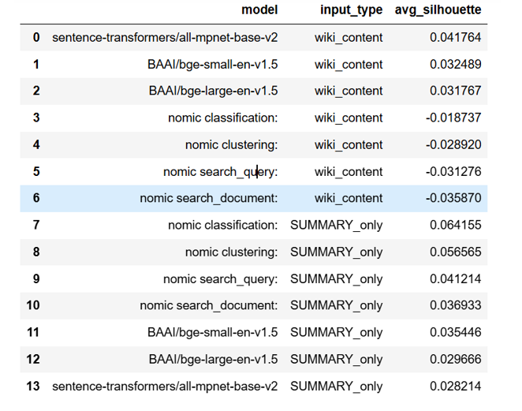
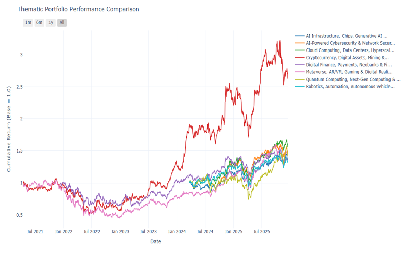

# Advanced Portfolio Intelligence System
### Semantic Analysis for Low-Risk Capital Management


##  Project Overview
Equity research is inherently unscalable; analysts waste countless hours filtering through noisy, unstructured text to find relevant signals. 

This project is an **End-to-End Semantic Search Engine** that converts raw unstructured data into investment-grade intelligence. It ingests the Russell 1000 ETF holdings, enriches them with entity resolution (Wiki/Bing/yFinance), and uses LLM-powered summarization to build thematic investment baskets.

##  System Architecture
The pipeline follows a robust **Extract-Transform-Load (ETL)** pattern:
1.  **Data Ingestion:** Automated scraping of Russell 1000 tickers with Selenium & yFinance fallbacks.
2.  **Storage:** Live MongoDB Data Warehouse with a self-healing schema design.
3.  **Processing:** LLM Map-Reduce summarization (Chunking → Extraction → Synthesis) to compress noise.
4.  **Vector Database:** Production embeddings generated using `nomic-embed-text` and `BAAI/bge-large`.
5.  [**Hybrid Search:** Lucene-standard sparse search combined with dense vector retrieval.

##  Key Results & Performance
We conducted a quantitative "Embedding Bake-Off" to select the optimal model for financial semantics.

* **Model Selection:** Nomic-based embeddings achieved the strongest sector-level separation (Silhouette Score: **0.064**) on LLM summaries.
* **Search Precision:** The hybrid search engine achieved a **Mean Reciprocal Rank (MRR@10) of 0.4347**, confirming that relevant companies consistently rank at the top.




*  **Investment Impact:** The "Cryptocurrency & Digital Assets" theme identified by the system materially outperformed the baseline over a 12-month backtest.
 
###  Portfolio Performance

*Figure: The "Cryptocurrency" theme (Red line) identified by our semantic search engine significantly outperformed baseline themes over a 12-month period.*

## 🔧 Technical Highlights
* **Self-Healing Pipelines:** The system uses `$exists`-based flags and idempotent writes to detect missing data and only recompute what is absent[cite: 81, 85].
* **Map-Reduce Summarization:** Breaks down complex financial documents into material points before synthesis, reducing token costs and hallucination risk.
* **Human-in-the-Loop:** Final thematic classifications are reviewed to prevent misclassification errors.

##  Repository Structure
```text
├── src/                 # Data Ingestion and Processing pipelines
├── models/              # Embedding generation and "Bake-Off" evaluation scripts
├── tests/               # Unit tests for the search engine
└── README.md            # Project documentation


